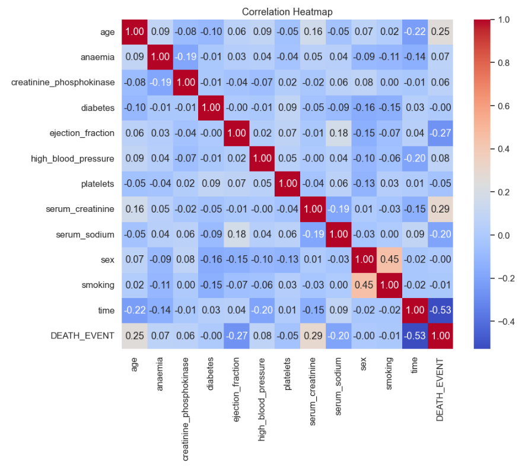
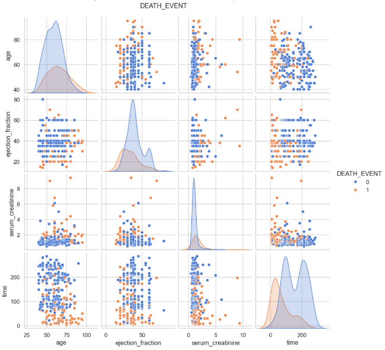
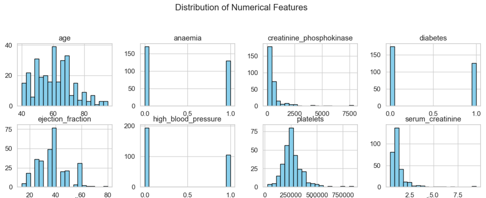

# Heart Failure Prediction — End-to-End Machine Learning Project

This repository demonstrates a full end-to-end machine learning workflow using the **Heart Failure Clinical Records** dataset.  
It covers everything from **EDA** and **feature analysis** to **model training**, **hyperparameter tuning**, **model export**, and a **FastAPI prediction service** with Docker support.

---

## 🚀 Live demo

Deployed on GitHub Pages: https://mdislammazharul.github.io/Heart_Failure_Prediction/

**What to explore on the site**

- **Landing page:** first 10 rows of dataset, model summary, EDA visuals.
- **Predict page:** real-time inference using deployed FastAPI backend.
- **Training report:** full notebook converted to HTML (link).

---

## 📚 Table of Contents

- [Heart Failure Prediction — End-to-End Machine Learning Project](#heart-failure-prediction--end-to-end-machine-learning-project)
  - [🚀 Live demo](#-live-demo)
  - [📚 Table of Contents](#-table-of-contents)
  - [🔍 Project Overview](#-project-overview)
  - [🖼️ Exploratory Data Analysis](#️-exploratory-data-analysis)
    - [1️⃣ Correlation Heatmap](#1️⃣-correlation-heatmap)
    - [2️⃣ Pairplot (Feature Relationships by Survival Outcome)](#2️⃣-pairplot-feature-relationships-by-survival-outcome)
    - [3️⃣ Numerical Feature Distribution (Histograms)](#3️⃣-numerical-feature-distribution-histograms)
  - [📊 Model Performance Summary](#-model-performance-summary)
    - [🔹 Logistic Regression](#-logistic-regression)
    - [🔹 Decision Tree](#-decision-tree)
    - [🔹 Random Forest](#-random-forest)
    - [🏆 Model Comparison (Validation Set)](#-model-comparison-validation-set)
    - [🥇 **Best Model: Random Forest**](#-best-model-random-forest)
  - [📂 Repository Structure](#-repository-structure)
  - [⚙️ Requirements](#️-requirements)
  - [🚀 Quick Start](#-quick-start)
    - [1. Clone the repository](#1-clone-the-repository)
    - [2. Ensure dataset is in place](#2-ensure-dataset-is-in-place)
    - [3. Either:](#3-either)
    - [4. Run API locally](#4-run-api-locally)
  - [🎓 Model Training](#-model-training)
  - [🌐 Running the FastAPI Service](#-running-the-fastapi-service)
  - [🐳 Docker](#-docker)
  - [📜 License](#-license)

---

## 🔍 Project Overview

This project predicts **death events** for heart failure patients based on a set of clinical features.

The workflow includes:

- Exploratory Data Analysis (EDA)
- Feature AUC scoring and ranking
- Train/Validation/Test split (60/20/20)
- Model training for:
  - Logistic Regression
  - Decision Tree
  - Random Forest
- Full hyperparameter tuning using Grid Search
- Best model selection via ROC-AUC
- Saving the final model as `heart_failure_model.pkl`
- FastAPI service for real-time predictions
- Dockerfile for container deployment

---

## 🖼️ Exploratory Data Analysis

### 1️⃣ Correlation Heatmap

This heatmap visualizes the pairwise correlation between all clinical features. It helps identify which variables are strongly related, potential multicollinearity issues, and which features have meaningful relationships with the target variable **DEATH_EVENT**.


### 2️⃣ Pairplot (Feature Relationships by Survival Outcome)

The pairplot shows how key features interact with each other, grouped by survival status (**DEATH_EVENT**). It helps reveal class separation patterns, feature distributions, and potential nonlinear relationships that may influence predictive performance.


### 3️⃣ Numerical Feature Distribution (Histograms)

These histograms display the distribution of important numerical features. They highlight skewness, outliers, and the overall range of values in the dataset—insights that guide preprocessing decisions such as scaling, transformations, and feature engineering.


---

## 📊 Model Performance Summary

### 🔹 Logistic Regression

```
Best Params: {'model__C': 0.1, 'model__solver': 'liblinear'}
Accuracy: 0.850
ROC-AUC: 0.908
F1 Score: 0.743
```

### 🔹 Decision Tree

```
Best Params: {'model__criterion': 'entropy',
              'model__max_depth': 3,
              'model__min_samples_split': 10}
Accuracy: 0.867
ROC-AUC: 0.865
F1 Score: 0.778
```

### 🔹 Random Forest

```
Best Params: {'model__max_depth': 5,
              'model__min_samples_split': 10,
              'model__n_estimators': 100}
Accuracy: 0.867
ROC-AUC: 0.909
F1 Score: 0.778
```

---

### 🏆 Model Comparison (Validation Set)

| Model               | Best Params                                                                              | Accuracy  | ROC-AUC   | F1 Score  |
| ------------------- | ---------------------------------------------------------------------------------------- | --------- | --------- | --------- |
| **Random Forest**   | `{'model__max_depth': 5, 'model__min_samples_split': 10, 'model__n_estimators': 100}`    | **0.867** | **0.909** | **0.778** |
| Logistic Regression | `{'model__C': 0.1, 'model__solver': 'liblinear'}`                                        | 0.850     | 0.908     | 0.743     |
| Decision Tree       | `{'model__criterion': 'entropy', 'model__max_depth': 3, 'model__min_samples_split': 10}` | 0.867     | 0.865     | 0.778     |

---

### 🥇 **Best Model: Random Forest**

The **Random Forest** achieved the highest **ROC-AUC (0.909)** and tied for the highest **Accuracy (0.867)**, making it the best-performing model in this project.

---

## 📂 Repository Structure

```

├── Mid_Term_Project.py                # Full training workflow (EDA → model)
├── main.py                            # FastAPI prediction endpoint
├── heart_failure_clinical_records_dataset.csv
├── heart_failure_model.pkl            # Saved model (after training)
├── Dockerfile
└── figures/                           # EDA figures

```

---

## ⚙️ Requirements

Recommended: Python 3.11+

Install dependencies:

```bash
pip install fastapi uvicorn pandas scikit-learn seaborn matplotlib
```

---

## 🚀 Quick Start

### 1. Clone the repository

```bash
git clone https://github.com/mdislammazharul/ml-churn-prediction
cd ml-churn-prediction
```

### 2. Ensure dataset is in place

Place `heart_failure_clinical_records_dataset.csv` in the project root.

### 3. Either:

- Train the model yourself
  **OR**
- Place `heart_failure_model.pkl` in the project root.

### 4. Run API locally

```bash
uvicorn main:app --host 0.0.0.0 --port 8000 --reload
```

Open the docs:

👉 [http://127.0.0.1:8000/docs](http://127.0.0.1:8000/docs)

---

## 🎓 Model Training

Run the training workflow:

```bash
python Mid_Term_Project.py
```

The script includes:

- Data preprocessing
- EDA
- Feature AUC evaluation
- Grid Search CV for 3 models
- Final model selection
- Model saving
- Printed evaluation metrics

After training, the model is saved as:

```
heart_failure_model.pkl
```

---

## 🌐 Running the FastAPI Service

Example prediction request:

```bash
curl -X POST "http://127.0.0.1:8000/predict" \
 -H "Content-Type: application/json" \
 -d '{
   "age":65,
   "anaemia":0,
   "creatinine_phosphokinase":250,
   "diabetes":1,
   "ejection_fraction":35,
   "high_blood_pressure":1,
   "platelets":250000,
   "serum_creatinine":1.9,
   "serum_sodium":130,
   "sex":1,
   "smoking":0,
   "time":120
 }'
```

Response example:

```json
{
  "prediction": 0,
  "probability_death": 0.12
}
```

---

## 🐳 Docker

Build:

```bash
docker build -t heart-failure-api .
```

Run:

```bash
docker run -p 8000:8000 heart-failure-api
```

---

---

## 📜 License

MIT License
Feel free to use, modify, and distribute.
